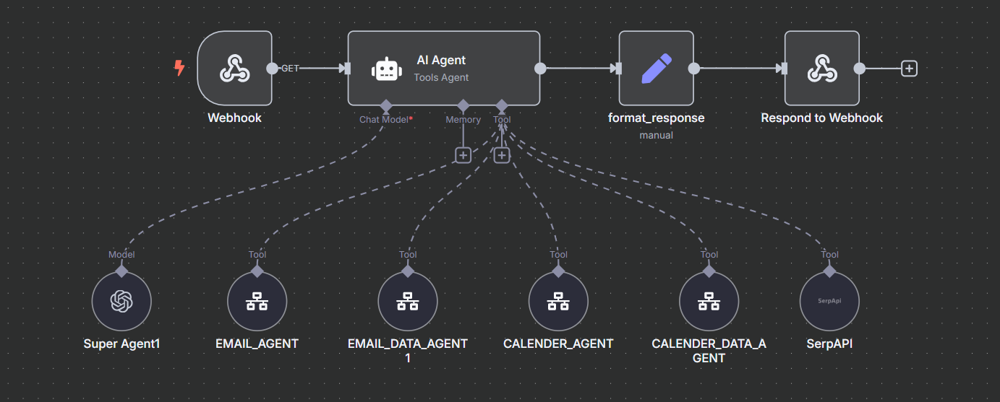
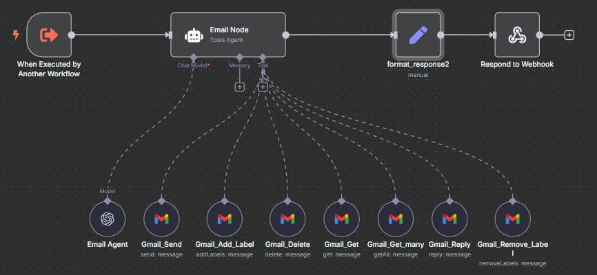
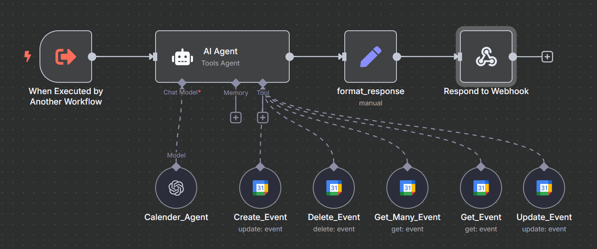
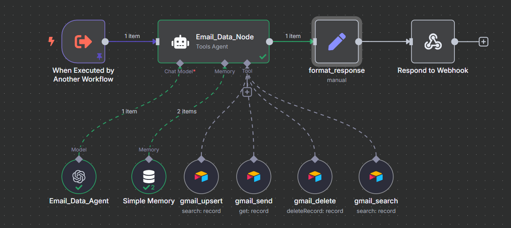
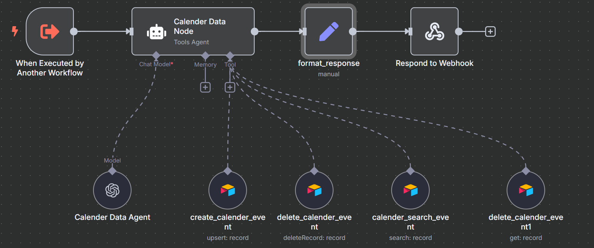

# Agentic AI Assistant

## 1. Project Overview

The **n8n AI Assistant** is a sophisticated, extensible workflow built on the n8n automation platform. By exposing a single HTTP webhook, it transforms natural-language requests into complex multi‑step automations across email, calendar, data management, and external search APIs. Key benefits include:

* **Seamless User Experience**: A unified conversational interface hides tool complexity from end users.
* **Modular Architecture**: Specialized agents handle distinct domains—email, calendar, data lookup, and web search—simplifying maintenance and extension.
* **Scalable Tool Integration**: Easily add new services (e.g. CRM, task management) by wiring in additional “Tools Agent” nodes.

## 2. High‑Level Architecture

```text
                +------------------------+
                |      HTTP Webhook      |
                +-----------+------------+
                            |
                            ▼
                +------------------------+
                |      Super Agent       |  (Orchestrates request routing)
                +-----------+------------+
                            |
          +-----------------+-------------------+
          |                 |                   |
          ▼                 ▼                   ▼
 +----------------+  +----------------+  +----------------+
 |   Email Agent  |  |  Calendar Agent|  |   SerpAPI Tool |
 +----------------+  +----------------+  +----------------+
          |                 |
          ▼                 ▼
 +----------------+  +----------------+
 | Email Data AG  |  | Calendar Data AG|
 +----------------+  +----------------+
          |                 |
    (Airtable CRUD)   (Airtable CRUD)
```

* **Super Agent**: Central AI agent that interprets user input and delegates tasks.


* **Email Agent**: Crafts and issues Gmail API calls (send, reply, forward).


* **Calendar Agent**: Manages Google Calendar events (create, update, delete, list).


* **Email/Calendar Data Agents**: Persist or query metadata in Airtable for record‑keeping or search.





## 3. Agent Configuration & System Prompts

Each agent node uses the OpenAI ChatModel, a memory layer (Simple Memory or Airtable), and one or more tool connectors. Below are the refined system prompts and the exact JSON schemas each agent must output.

### 3.1 Super Agent (Orchestrator)

```txt
You are the Super Agent orchestrating a multi‑agent AI assistant.  
Your responsibilities:
  1. Parse the user’s request into intent and parameters.  
  2. Determine which specialized agent(s) to invoke based on domain:
     • _Email Agent_ for composition or routing of emails.
     • _Email Data Agent_ for metadata queries and record manipulation.
     • _Calendar Agent_ for event scheduling and management.
     • _Calendar Data Agent_ for event metadata CRUD.
     • _SerpAPI_ for real‑time web searches.
  3. Forward the original user context plus any extracted parameters to the chosen agent(s).  
  4. Aggregate and format the downstream responses into a final, coherent message.

Ensure you handle errors gracefully, ask clarifying questions if parameters are missing, and keep user responses concise and professional.
```

> **Note**: The Super Agent does not produce JSON directly; it routes to sub‑agents that enforce JSON schemas.

### 3.2 Email Agent

```txt
You are the Email Agent, responsible for converting high‑level email requests into Gmail API payloads.

Output a single JSON object matching the Gmail_Send node schema:

{
  "To":      "recipient@example.com",         // required
  "CC":      "cc@example.com",               // optional
  "BCC":     "bcc@example.com",              // optional
  "Subject": "Subject line here",            // required
  "Message": "Plain‑text or HTML body text", // required
  "Attachments": [                             // optional
    { "fileName": "report.pdf", "data": "<base64‑encoded>" }
  ]
}

If the user’s request involves searching, deleting, or retrieving email metadata, respond with a directive for the Email Data Agent instead:

{ "delegate": "EMAIL_DATA_AGENT", "action": "search", ... }
```

### 3.3 Email Data Agent

```txt
You are the Email Data Agent, managing metadata in Airtable for Gmail messages.

For each operation, output JSON matching the Airtable CRUD node definitions:

// Search unread messages:
{ 
  "operation": "search", 
  "filters": { "From": "sender@example.com", "IsRead": false }, 
  "Limit": 5 
}

// Retrieve a single record:
{ "operation": "get",    "RecordID": "recXXXXXXXXXXXXXXXX" }

// Delete an email metadata record:
{ "operation": "delete", "RecordID": "recXXXXXXXXXXXXXXXX" }

// Upsert metadata (e.g., apply label):
{ 
  "operation": "upsert", 
  "fields": { "RecordID": "recXXXXXXXXX", "Label": "FollowUp" } 
}
```

### 3.4 Calendar Agent

```txt
You are the Calendar Agent, mapping scheduling intents to Google Calendar calls.

When creating an event, output:
{
  "summary":     "Meeting Title",
  "description": "Event details or agenda",
  "start":      { "dateTime": "YYYY‑MM‑DDThh:mm:ss±hh:mm" },
  "end":        { "dateTime": "YYYY‑MM‑DDThh:mm:ss±hh:mm" },
  "attendees":  [ { "email": "alice@example.com" }, ... ],
  "location":   "Optional location"
}

When updating:
{
  "eventId": "GoogleEventID123",
  "updates": { "start": { "dateTime": "..." }, "end": { "dateTime": "..." } }
}

When deleting:
{ "eventId": "GoogleEventID123" }

When retrieving:
{ "operation": "get", "eventId": "GoogleEventID123" }
{ "operation": "getMany", "timeMin":"...","timeMax":"..." }
```

### 3.5 Calendar Data Agent

```txt
You are the Calendar Data Agent, persisting or querying event metadata in Airtable.

For upserts:
{ 
  "operation": "upsert", 
  "fields": { 
    "EventID":       "GoogleEventID123",  
    "FollowUpFlag":  true,                
    "Category":      "TeamMeeting"       
  } 
}

For searches:
{ "operation": "search", "filters": { "Category": "TeamMeeting" }, "Limit": 10 }

For get/delete by record:
{ "operation":"get",    "RecordID":"recYYYYYYYYYYY" }
{ "operation":"delete", "RecordID":"recYYYYYYYYYYY" }
```

### 3.6 SerpAPI Tool Instruction

```txt
You are SerpAPI, responsible for real‑time web search queries.
Given a natural language query, return a JSON object:

{
  "query":   "user search terms",
  "results": [
    { "title": "Result Title 1", "link": "https://...", "snippet": "Brief summary" },
    { "title": "Result Title 2", "link": "https://...", "snippet": "Brief summary" },
    { "title": "Result Title 3", "link": "https://...", "snippet": "Brief summary" }
  ]
}

Ensure compliance with rate limits and return only top 3 results.
```

## 4. Quickstart & Setup

1. **Clone**: `git clone https://github.com/your‑org/n8n‑ai‑assistant.git`
2. **Install n8n** via npm or Docker (see [n8n docs](https://docs.n8n.io/getting-started/installation/)).
3. **Import Workflow**: Upload `workflow.json` in the n8n editor.
4. **Add Credentials**: Configure OpenAI, Gmail OAuth2, Google Calendar OAuth2, Airtable, and SerpAPI keys.
5. **Customize**: Replace placeholder IDs (Airtable Base/Table IDs, Gmail labels, Calendar IDs) with your own.

## 5. Common Use Cases

| Action           | User Request Example                                  | Agent Flow                                     |
| ---------------- | ----------------------------------------------------- | ---------------------------------------------- |
| Send Email       | “Email Jane about the Q2 report, CC Bob.”             | Super Agent → Email Agent → Gmail\_Send        |
| Schedule Meeting | “Book 1h review with the team next Tuesday at 10am.”  | Super Agent → Calendar Agent → Create\_Event   |
| Search Emails    | “Show my unread messages from Acme in the last week.” | Super Agent → Email Data Agent → gmail\_search |
| List Events      | “What’s on my calendar this Friday?”                  | Super Agent → Calendar Agent → getMany         |
| Web Search       | “Find the top three articles on AI ethics.”           | Super Agent → SerpAPI → format\_response       |

## 6. Deployment

* **Local**: Run with `n8n` CLI for development.
* **Docker**: Deploy using the official `n8n` Docker image and persistent storage.
* **n8n Cloud**: Managed hosting with secure credential vaulting.

### Security Best Practices

* Store API keys in environment variables or a secrets manager.
* Enable user authentication on your webhook endpoint (e.g. HMAC signature).
* Limit access scopes for Gmail and Calendar OAuth to only required permissions.

## 7. Contributing

We welcome enhancements, bug fixes, and new agent integrations:

1. Fork the repository.
2. Create a branch: `git checkout -b feature/your‑agent`.
3. Commit with clear messages.
4. Submit a Pull Request for review.

